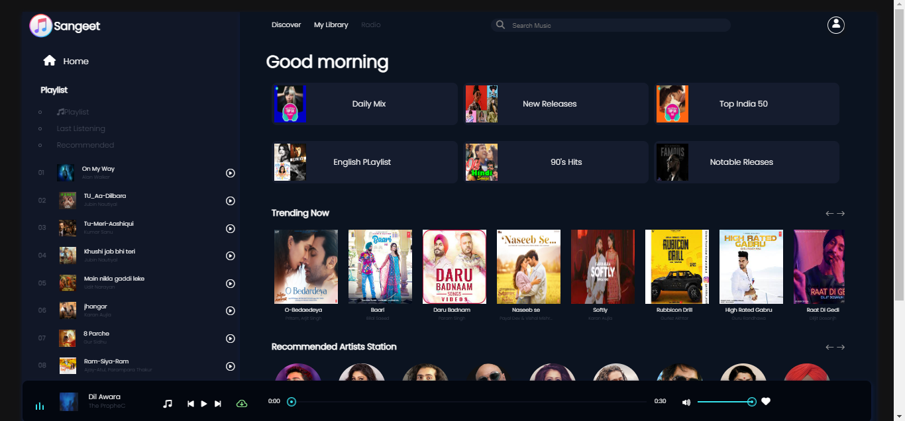

# Music Application

## Introduction

Welcome to the Music Application! This is a JavaScript-based application that allows users to browse, play, and manage their music collection. It supports features like creating playlists, searching for songs, and playing music.

## Demo

[Link to Demo](http://192.168.50.105:56831/index.html)

## Screenshots

## Features

1. Browse Music: Browse your music collection by albums, artists, and genres.
2. Play Music: Play songs, pause, skip, and seek within tracks.
3. Create Playlists: Create and manage playlists of your favorite songs.
4. Search: Search for songs, albums, and artists.
5. Responsive Design: Works on both desktop and mobile devices.

## Usage

1.Adding Music
To add music to your collection, place your audio files in the music directory. Supported formats are .mp3, .wav, and .ogg.

2. Creating a Playlist
   Navigate to the Playlists section.
   Click on "Create New Playlist".
   Add songs to your playlist and save.

3.Playing Music
Browse your music collection.
Click on a song to start playing.

4. Search
   Use the search bar to find songs, albums, or artists.

## Project Structure

Here is a brief overview of the project structure:

music-application/
│
├── public/ # Static files (HTML, CSS, images)
├── src/ # Source files
│ ├── components/ # React components
│ ├── pages/ # Page components
│ ├── assets/ # Media assets (images, icons)
│ ├── utils/ # Utility functions
│ ├── App.js # Main application component
│ ├── index.js # Entry point
│
├── music/ # Directory for music files
│
├── package.json # Project metadata and dependencies
├── README.md # This file

## Technologies Used

Frontend: React, HTML, CSS
Backend: Node.js, Express (if applicable)
Audio Playback: HTML5 Audio API
State Management: Redux (optional)
Styling: CSS, Sass (optional)

## Contributing

Contributions are welcome! Please follow these steps to contribute:

Fork the repository.
Create a new branch (git checkout -b feature-branch).
Make your changes and commit them (git commit -m 'Add new feature').
Push to the branch (git push origin feature-branch).
Create a pull request.

## Contact

For any questions or suggestions, please contact us at [harshthakur0047@gmail.com].
